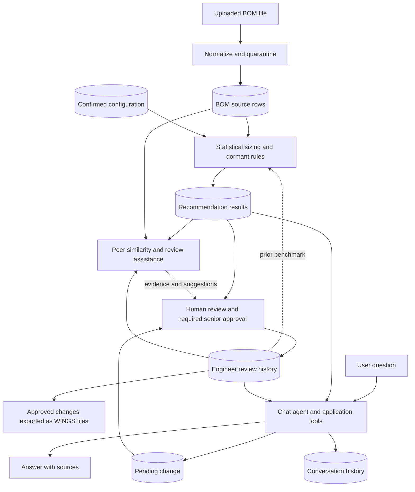

# BOM Review Assistant: Current Main Features

Reviewed: 8 September 2026. Scope: the main workflow connected to the current application UI and backend. Deployment settings were not verified.

## Summary

| Requested item | Current main workflow |
|---|---|
| Data source | Uploaded BOM review files, historical engineer decisions, maintained stocking rules, and saved conversations. |
| Model dependencies | Statistical stock sizing and dormant rules calculate quantities. Peer similarity and review assistance provide supporting evidence. The chat agent retrieves information, explains results, and stages proposals. |
| Data flow | BOM upload → statistical sizing → peer evidence and review assistance → human review/approval → WINGS export. Stored decisions support subsequent reviews. |
| Linkage to other data sources | Supabase/Postgres stores application data. BOM files supply inventory and procurement context. The configured LLM endpoint supports chat and explanations. WINGS receives downloadable update files. |

Min = minimum stock; ROP = reorder point; Max = maximum stock.

## 1. Data sources

| Source | Main data | Used for |
|---|---|---|
| **Uploaded BOM review CSV/Excel** | Item and stockroom IDs, descriptions, current Min/ROP/Max, consumption, unit price, lead time, criticality, procurement attributes, and existing factory review values. | The primary input for stock sizing, financial exposure, and item review. Stored in `batches` and `bom_rows`. |
| **Historical engineer decisions** | Final Min/ROP/Max, decision, justification, comments, reviewer, and approval status. | Same-item precedent, comparisons with similar parts, and review assistance. Stored in `review_history` alongside the original source snapshots. |
| **Engineer-maintained configuration** | Part-category patterns, dormant-stock policies, machine-criticality overrides, and review thresholds. | Classification, stocking policy, peer matching, and review guidance. Changes requiring confirmation take effect after approval. |
| **Saved conversations** | User questions, assistant answers, tool calls, session, and model/provider information. | Reopening chat sessions, intent-routing context, and traceability. Stored in `conversation_turn`. |

The default upload scope is **TCB**. Required columns are `item_id`, `max_qty`, `rop_qty`, `min_qty`, and `unitprice`.

For demand sizing, the engine reads cumulative consumption over **5, 30, 90, 180, 365, and 547 days**, plus usage frequency. These are snapshot-based demand-rate inputs. Lead time, order multiples, and source criticality determine the stocking calculation and constraints.

Ingestion normalizes headers and values, then quarantines missing item IDs, duplicate item/stockroom keys, negative consumption, and inconsistent consumption windows. Quarantined rows remain stored and are excluded from scoring.

Sources: [ingestion](../backend/app/ingestion.py), [upload endpoint](../backend/app/routers/upload.py), [database schema](../backend/app/db.py).

## 2. Model dependencies: linked to the agent or standalone

| Main component | Calculation / dependencies | Can run without the chat agent? |
|---|---|---|
| **Statistical stock-sizing engine** (`stat-v2`) | pandas, NumPy, and SciPy. Uses Poisson or negative-binomial demand distributions to calculate Min/ROP/Max. | **Yes.** `engine_statistical.run(df, cfg)` runs directly with supplied data and configuration, without a database or LLM. The application adapter loads and saves database records around it. |
| **Dormant-stock rules** | Deterministic policies for parts with no consumption: hold current, fixed quantity, or zero. Item rules take precedence over category rules, then the default rule. | **Yes.** Applied within stock sizing. The application loads confirmed rules from the database. Chat provides another way to propose a rule; confirmation belongs to a different senior/admin approver. |
| **Peer similarity** (`knn-v1`) | NumPy-based nearest-neighbor comparison using machine family, criticality, demand classification, lead-time/price bands, policy, supplier, and sharing status. Category matching constrains eligible peers. | **Yes.** Runs through backend functions/API with stored recommendations and historical reviews. Supplies comparable parts, historical quantities, and outlier evidence. |
| **Review assistance** (`assist-v2`) | Fixed evidence-gathering sequence, deterministic verdict and suggested values, then an LLM-generated explanation. | **Yes.** The batch UI calls `/assist/run` directly. Requires database evidence and reuses application tool functions. A live LLM is used for narration; verdicts and suggested values remain rule-derived. |
| **Chat assistant** | LangGraph intent routing, application tools, and an OpenAI-compatible LLM provider. | **Agent-linked.** BOM-specific answers depend on the application's records and tools. The configured provider/model is selected through `LLM_BASE_URL` and `LLM_MODEL`. |

The sizing engine handles **active, dying, dormant, and no-data** demand cases. Review assistance handles active/dying rows; dormant stocking is handled by confirmed rules.

The engine's confidence value is rule-derived. Assistance returns `flag_for_review`, `bulk_accept_candidate`, or `needs_context`, with supporting reasons. Its suggested Max/ROP comes from the engine or the item's prior decision.

**The engine calculates, the assistant explains, and the engineer approves.** A chat proposal is staged for confirmation; it does not directly become an approved stock change.

“Standalone” above refers to the calculation or service operating without chat. The complete web application still requires its backend, database, and installed dependencies.

Sources: [statistical engine](../backend/app/engine_statistical.py), [scoring adapter](../backend/app/engine_adapter.py), [dormant rules](../backend/app/dormant_rules.py), [similarity](../backend/app/similarity.py), [assist chain](../backend/app/assist/chain.py), [assist rules](../backend/app/assist/rules.py), [chat graph](../backend/app/agent/graph.py), [LLM provider](../backend/app/llm/provider.py).

## 3. Data flow: input → model → output → historical data

| Stage | Main processing | Stored result / output |
|---|---|---|
| **Input** | Next.js forwards uploads to FastAPI. The backend normalizes, filters, and checks rows. | `batches`, `bom_rows`, quarantine reasons. |
| **Stock sizing** | Load eligible rows, historical benchmarks, confirmed categories, and dormant rules; calculate stock levels. | `recommendation_result`: proposed quantities, action, risk, confidence, reasons, exposure, demand route, agreement, and versions. |
| **Review support** | Retrieve comparable historical parts, then evaluate active/dying rows and explain the result. The user runs this from the batch page or chat. | `similarity_result`, `similarity_neighbour`, and `assist_result`. |
| **Engineer decision** | Accept engine values, override with supplied values, or reject and retain current values. Overrides and High-risk reviews require a different senior/admin approver. | `review_history`, including current, engine, and final quantities plus approval status. |
| **Chat interaction** | Retrieve records, explain results, and stage engineer-specified stock changes or dormant-rule proposals. | Answers with sources, `conversation_turn`, and pending proposals awaiting the applicable human confirmation. |
| **Export** | Select fully reviewed changes. | WINGS CSV or Excel workbook. Pending approvals and unchanged quantities do not become update rows. |

### Historical data reuse

- **Same-item precedent:** reviews link to source rows using `(batch_id, item_id, stockroom_id)`. Prior decisions for the same item/stockroom support future comparisons.
- **Agreement checks:** scoring compares its result with factory review values supplied in the file, or an eligible prior review. The prior-review fallback checks the batch's data date and demand drift. This comparison affects agreement/confidence rather than calculated quantities.
- **Peer and review evidence:** similar parts' recorded decisions, agreement history, and justifications help explain which rows need attention and which prior quantities may be relevant.
- **Conversation continuity:** saved sessions can be reopened; recent turns support intent classification.
- **Traceability:** source snapshots, recommendations, and human decisions remain separate. Re-scoring preserves recommendations that already have reviews.

History supports retrieval and comparison; recording a review does not automatically retrain a model. Historical evidence can include reviews still awaiting senior approval; export eligibility is checked separately.

Sources: [frontend API](../frontend/src/lib/api.ts), [assist endpoint](../backend/app/routers/assist.py), [history tools](../backend/app/agent/tools.py), [review workflow](../backend/app/routers/review.py), [export assembly](../backend/app/services.py), [workbook export](../backend/app/export_xlsx.py).

## 4. Linkage to other data sources

| Source / system | Current linkage | What it means for the main workflow |
|---|---|---|
| **Supabase/Postgres** | Backend database connection, using direct Postgres or the configured HTTPS SQL RPC transport. | Shared storage for BOM batches, recommendations, configurations, historical decisions, and conversations. |
| **WINGS** | Incoming BOM files and outgoing CSV/XLSX update files. | The application prepares approved changes for WINGS. Applying the exported file happens outside this application. |
| **SFM context in the BOM file** | Fields such as `sfm_criticality` and `sfm_mean_lt_cd` arrive with the uploaded row. | Source criticality is used by statistical sizing. Lead-time context is available to the engine's configured policy. These fields are read from the snapshot. |
| **Supplier, procurement, and other-stockroom information** | Supplier, contractual lead time, order multiple, ownership, sharing, and inventory context embedded in the BOM file. | Supports sizing and peer/procurement evidence. Freshness follows the uploaded extract; there is no separate live lookup in this workflow. |
| **Engineer-maintained rules** | Configuration screens maintain category patterns, dormant-stock rules, and criticality overrides in the database. | Confirmed categories and dormant rules feed sizing. Criticality overrides support peer/procurement context; statistical sizing uses the source row's `sfm_criticality`. |
| **LLM endpoint** | Backend sends questions and selected evidence through the configured model provider. | Supports chat routing, explanations, and tool requests. Database tools supply the BOM-specific facts. |

Sources: [database configuration](../backend/app/config.py), [REST transport](../backend/app/rest_conn.py), [configuration endpoints](../backend/app/routers/rules_config.py), [LLM transport](../backend/app/llm/nyra.py), [export endpoints](../backend/app/routers/export.py).
