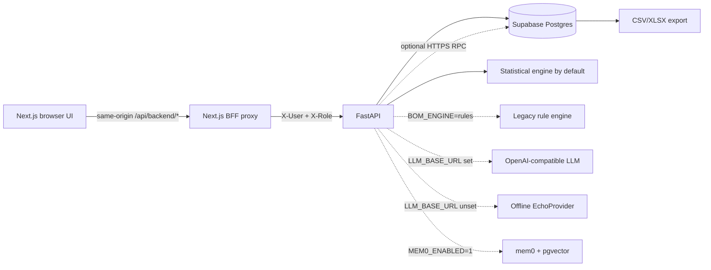
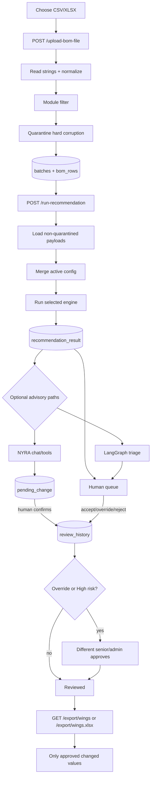

# BOM Review Assistant: Current Codebase, End to End

> Last traced against the working tree on 18 August 2026.
>
> This document describes what the code currently does, including implementation
> details, safety boundaries, optional paths, and known gaps. It starts with a
> BOM CSV/Excel upload and ends with the downloadable WINGS CSV/XLSX artifacts.
> Where comments, UI text, and runtime behavior disagree, this document follows
> the executable code.

## 1. What the system is

The application is a human-in-the-loop spare-parts BOM review system. It does
four different jobs, with explicit boundaries between them:

1. It ingests a monthly BOM extract, normalizes known source defects, quarantines
   structurally unsafe rows, and stores each source row without flattening away
   its original columns.
2. It calculates proposed Min/ROP/Max stocking levels with a deterministic
   engine. The statistical engine is the runtime default; a legacy rule engine
   can be selected through an environment variable.
3. It helps engineers prioritize and explain the resulting queue through the
   console, optional advisory triage, and the NYRA chat tool loop.
4. It records human decisions and exports only fully reviewed changes. An
   override, or any decision on a High-risk row, needs a second person.

The governing product rule is encoded in several places:

> The engine calculates. NYRA explains. The engineer approves. WINGS updates
> only after approval.

There is no live WINGS connector. The final operation in this repository is a
downloaded CSV or XLSX file for downstream WINGS use.

## 2. Runtime topology



The main runtime directories are:

| Area | Responsibility |
|---|---|
| `frontend/src/app` | Next.js pages and the backend-for-frontend proxy |
| `frontend/src/components` | Queue, workflow, triage, chat, and shared UI |
| `backend/app/routers` | FastAPI endpoint definitions and HTTP concerns |
| `backend/app/ingestion.py` | CSV/Excel parsing, normalization, filtering, quarantine, persistence |
| `backend/app/engine_statistical.py` | Production-default statistical sizing |
| `analysis/engine/engine.py` | Legacy/backtested rules engine |
| `backend/app/engine_adapter.py` | Common loading, config, engine selection, and result persistence |
| `backend/app/services.py` | Derived workflow status and export row assembly |
| `backend/app/agent` | Chat tools, bounded tool loop, LangGraph triage, and prompts |
| `backend/app/db.py` | Schema, connection selection, SQL translation, and startup migration |
| `backend/app/rest_conn.py` | Optional Supabase `exec_sql` HTTPS transport |
| `analysis` | Offline profiling, backtests, calibration, and validation; not request-time code |

## 3. Startup and configuration

### 3.1 Frontend startup

The frontend is Next.js 16 with React 19. It normally runs on port `3010`:

```powershell
cd frontend
npm run dev -- --webpack --port 3010
```

All browser requests go to the local Next.js route
`/api/backend/[...path]`. That route forwards to `BACKEND_URL`, which defaults
to `http://127.0.0.1:8011`.

The proxy:

- preserves query parameters;
- forwards only `GET` and `POST` because only those handlers are exported;
- forwards multipart uploads as `FormData` and other bodies as text;
- forwards `Content-Type` except for multipart, where `fetch` must generate the
  boundary;
- forwards `content-type`, `content-disposition`, `cache-control`, and every
  response header beginning with `x-`;
- streams `application/x-ndjson` bodies without first buffering them;
- converts a connection failure into HTTP 503 with a backend startup hint.

No browser-to-FastAPI CORS setup is needed because the browser sees only the
same-origin Next.js proxy.

### 3.2 Backend startup

The FastAPI app normally runs on port `8011`:

```powershell
.venv\Scripts\python.exe -m uvicorn app.main:app --app-dir backend --port 8011
```

Importing `app.main` constructs the FastAPI object but does not touch the
database. The lifespan hook calls `init_db()` only when the application starts.
This prevents editors, documentation tools, and incidental imports from issuing
DDL against the configured Supabase project.

At startup, `init_db()`:

1. Requires an explicitly configured database.
2. Chooses direct Postgres, Supabase REST/RPC, or test-only SQLite.
3. Runs the dialect-specific `CREATE TABLE IF NOT EXISTS` and index DDL.
4. On Postgres, checks for missing foreign-key constraints and adds them.
5. Adds newer columns that `CREATE TABLE IF NOT EXISTS` cannot add to an old
   database (`route`, `consumable`, `agreement`, and
   `procurement_narrative`).
6. Seeds `rule_config` from `analysis/engine/rule_config.json` if no rule
   configuration exists.

`GET /health` then reports the API version, selected database transport,
selected LLM/provider, and whether mem0 is enabled.

### 3.3 `.env` loading

`backend/app/config.py` implements a small `.env` reader instead of adding
`python-dotenv`.

- It reads `backend/.env` with UTF-8 BOM support.
- Blank lines, comments, and lines without `=` are ignored.
- Leading/trailing whitespace and one layer of matching quote characters are
  stripped from values.
- Existing process environment variables win.
- Inline comments are not generally parsed.
- When `BOM_ALLOW_SQLITE=1`, the file is skipped completely so the offline test
  suite cannot accidentally recover a real `DATABASE_URL` from `.env`.

### 3.4 Database selection

Selection order is:

1. A non-empty `DATABASE_URL` beginning with `postgres://` or
   `postgresql://` selects direct Postgres.
2. If `DATABASE_URL` is empty, `SUPABASE_URL` plus either
   `SUPABASE_SECRET_KEY` or legacy `SUPABASE_SERVICE_ROLE_KEY` selects the
   Supabase HTTPS/RPC transport.
3. `BOM_ALLOW_SQLITE=1` selects SQLite for tests only.
4. Anything else raises `DatabaseNotConfigured`; the server does not silently
   create a local production database.

If both direct Postgres and Supabase REST settings exist, `DATABASE_URL` wins.

Direct Postgres uses psycopg dictionary rows and real multi-statement
transactions. On the proxied developer network, `backend/scripts/proxy_tunnel.py`
provides the local TCP endpoint that libpq itself cannot establish through an
HTTP proxy.

The REST path calls a service-role-only `exec_sql` PostgREST RPC. It translates
SQLite-style `?` placeholders to `$1`, `$2`, and so on; quotes the reserved
Postgres column name `user`; translates `datetime('now')`; and batches
`executemany()` inserts in groups of 500.

Important REST trade-off: one HTTP call is one transaction. `commit()` and
`rollback()` on `RestConn` cannot group or undo multiple calls. The code uses a
single data-modifying CTE for the two most dangerous paired writes—activating a
new rules version and confirming a staged chat proposal—but ingestion, bulk
review, audit writes, and other multi-call paths can still partially succeed if
a later RPC fails.

The Supabase secret/service-role key remains server-side. The code deliberately
does not accept an anon/publishable key for arbitrary SQL execution.

### 3.5 Engine selection

`backend/app/engine_adapter.py` selects the engine at each score call:

```text
BOM_ENGINE=rules  -> analysis/engine/engine.py
anything else     -> backend/app/engine_statistical.py
```

Therefore the statistical engine is the runtime default. The broad workflow
test suite pins `BOM_ENGINE=rules`; the statistical engine has its own focused
tests. Test expectations from the general workflow suite are not automatically
proof of default-production sizing behavior.

### 3.6 LLM selection

`LLM_BASE_URL` controls the provider:

- unset: `EchoProvider`, deterministic and offline;
- set: `NyraProvider`, using the OpenAI-compatible Chat Completions tool-call
  format with temperature `0`.

`LLM_MODEL`, `LLM_API_KEY`, and `LLM_TIMEOUT_S` configure the network provider.
The HTTP client trusts proxy environment variables.

### 3.7 Environment variable reference

| Variable | Current use |
|---|---|
| `BACKEND_URL` | Frontend BFF target; defaults to `http://127.0.0.1:8011` |
| `DATABASE_URL` | Direct Postgres DSN; takes precedence over REST settings |
| `SUPABASE_URL` | Supabase project URL for REST/RPC mode |
| `SUPABASE_SECRET_KEY` | Preferred current server-side RPC key |
| `SUPABASE_SERVICE_ROLE_KEY` | Legacy server-side JWT RPC key |
| `SUPABASE_ANON_KEY` | Explicitly ignored by this backend |
| `SUPABASE_TIMEOUT_S` | REST/RPC HTTP timeout; defaults to 60 seconds |
| `BOM_ALLOW_SQLITE` | Test-only opt-in; `1` also prevents `.env` loading |
| `BOM_DB_PATH` | SQLite test database path |
| `BOM_ENGINE` | Exact lowercase value `rules` selects the legacy engine |
| `LLM_BASE_URL` | Enables the OpenAI-compatible network provider |
| `LLM_MODEL` | Network model; defaults to `gpt-4o-mini` in the provider factory |
| `LLM_API_KEY` | Network provider credential |
| `LLM_TIMEOUT_S` | LLM HTTP timeout; defaults to 30 seconds |
| `LLM_REDACT_PROMPTS` | `1` enables structured tool argument/result masking |
| `HTTPS_PROXY` | Used by httpx/OpenAI-compatible HTTP traffic through `trust_env` |
| `MEM0_ENABLED` | `1` enables lazy mem0 initialization |
| `MEM0_DATABASE_URL` | Direct Postgres DSN for pgvector; falls back to `DATABASE_URL` |
| `MEM0_DIR` | Optional mem0 local metadata directory; otherwise temporary |
| `MEM0_LLM_MODEL` | mem0 extraction model; falls back to `LLM_MODEL` |
| `MEM0_EMBEDDING_MODEL` | Defaults to `text-embedding-3-small` |
| `MEM0_EMBEDDING_DIMS` | Positive integer, default 1536 |
| `OPENAI_BASE_URL` / `OPENAI_API_KEY` | mem0-only fallback when matching `LLM_*` values are absent |
| `BOM_MODEL_DIR` | Directory searched by the currently disconnected future ML seam |

## 4. Complete lifecycle at a glance



## 5. Phase 1: upload from the frontend

The main batch page (`/`) provides the standard upload form.

The user chooses:

- `.csv`, `.xlsx`, or `.xls`;
- a required free-text batch label;
- module `TCB`, `Epoxy`, or `ALL`;
- exact or multi-tag matching;
- whether to call the scoring endpoint immediately after ingestion.

The default UI values are `Jan26`, `TCB`, exact match, and “Run engine now.”
Upload controls are enabled for `engineer`, `senior`, `admin`, and `it`.

The chat page also has an “Attach CSV” path. That path:

- accepts CSV only in the browser picker;
- derives the label from the filename by removing a `.csv` suffix;
- hard-codes `module_filter=TCB`;
- ingests but does not score;
- tells the user to open Batches and score it.

## 6. Phase 2: HTTP upload boundary

`POST /upload-bom-file` is multipart form data with:

| Field | Behavior |
|---|---|
| `file` | Required upload; filename must end in `.csv`, `.xlsx`, or `.xls` |
| `label` | Required batch label |
| `module_filter` | Defaults to `TCB` |
| `module_match` | `exact` by default; only `exact` or `tag` accepted |

The entire file is read into memory. Files over 100 MiB are rejected with HTTP
413. A disallowed extension, invalid match mode, parse failure, missing required
columns, unavailable filter column, or empty post-filter dataset returns HTTP
400.

The route passes the uploaded username into ingestion, writes an audit entry
after ingestion returns, commits, and returns the ingestion summary.

One transaction detail matters: `ingest()` itself commits the batch and rows
before the router writes the audit row. A later audit failure can therefore
leave a successfully ingested batch without its expected audit record, even on
the direct Postgres transport.

## 7. Phase 3: file parsing

### 7.1 CSV

CSV parsing uses pandas with:

- `dtype=str`, so input values are initially strings;
- `encoding="utf-8-sig"`, so a UTF-8 BOM is tolerated;
- `keep_default_na=False`, so empty CSV cells stay empty strings instead of
  becoming `NaN`.

Any pandas parsing exception becomes `IngestionError("Could not parse CSV: …")`
and ultimately HTTP 400.

### 7.2 Excel

For `.xlsx` or `.xls`, ingestion first reads at most the first 25 rows without
a header. The first row containing a cell equal to `item_id`, after trimming
and lowercasing, becomes the real header row. If no such row is found, row zero
is used and required-column validation will normally catch the mismatch.

The complete selected sheet is then read as strings and missing cells are
filled with empty strings. There is no sheet selector; pandas' default first
sheet is used.

The endpoint accepts legacy `.xls`, but the pinned requirements contain
`openpyxl` rather than `xlrd`. Whether `.xls` actually parses therefore depends
on an additional engine being present in the environment; otherwise it fails
cleanly as HTTP 400.

## 8. Phase 4: normalization

Normalization happens before filtering and quarantine:

1. Every column name is trimmed.
2. Every string-capable column has surrounding whitespace stripped from each
   cell.
3. Two known misspellings are renamed:
   - `new_modulle` -> `new_module`
   - `senstivity_tag` -> `sensitivity_tag`
4. Exact lowercase variants of `increase algo`, `maintain algo`, and
   `decrease algo` in `sfm_recommendation` are normalized to title-case verbs,
   for example `Maintain Algo`.

The five required columns are:

```text
item_id, max_qty, rop_qty, min_qty, unitprice
```

Many columns used by either engine are optional. Missing optional numeric
columns later become `NaN` and are handled by engine-specific fallbacks.

## 9. Phase 5: module filtering

Filtering occurs before quarantine, so batch counts and duplicate detection are
for the selected subset, not the full uploaded file.

### Exact mode

- `ALL` disables filtering.
- Otherwise a `module` column must exist.
- The comparison is exact and case-sensitive after whitespace stripping.

### Tag mode

- It uses `new_module` when present, otherwise `module`.
- The selected filter text is lowercased and searched as a literal substring.
- This retains multi-tag values such as `Module-TCB,Module-Epoxy` for either
  matching module.
- Regex interpretation is disabled.

If zero rows remain, the upload is rejected and no batch is created.

## 10. Phase 6: quarantine

Quarantine means “persist the row, but never send it to the engine.” It is
reserved for hard corruption. Softer data-quality problems are left for engine
validation or review.

Reasons are assigned in this order:

1. `MISSING_ITEM_ID`
2. `DUPLICATE_KEY`
3. `NEGATIVE_CONSUMPTION`, only if no prior reason exists
4. `CONSUMPTION_LADDER_BROKEN`, only if no prior reason exists

The duplicate key is `(trimmed item_id, stockroom_id)`. Every occurrence of a
duplicated key is marked, not only the later occurrence.

Negative consumption checks these cumulative source columns:

```text
last_5_day_cnsmptn_qty
last_30_day_cnsmptn_qty
last_90_day_cnsmptn_qty
last_180_day_cnsmptn_qty
last_365_day_cnsmptn_qty
last_547_day_cnsmptn_qty
```

The cumulative ladder must be non-decreasing as the time window grows. For
example, 30-day consumption cannot exceed 90-day consumption. Non-numeric
values coerce to `NaN` and do not, by themselves, trigger these two quarantine
checks.

Because `bom_rows` has a composite primary key, duplicate and missing item IDs
cannot all be stored under their original key. A repeated key or blank item ID
is stored with an internal `#dup<row-index>` suffix. Its JSON payload still
preserves the normalized source record. These rows are quarantined and are not
scored.

## 11. Phase 7: ingestion persistence

Ingestion inserts one `batches` row with:

- label and source filename;
- uploader;
- selected module filter or `ALL`;
- row count after filtering;
- quarantined count;
- default status `loaded`;
- a UTC-like text timestamp generated by the database.

It then inserts every filtered row into `bom_rows`:

- composite key `(batch_id, item_id, stockroom_id)`;
- source `module` as a convenience column;
- quarantine flag and reason;
- the complete normalized source record as JSON text in `payload`.

This is a deliberate denormalization. The source currently arrives as one wide
workbook, so the code preserves full source fidelity in one JSON payload rather
than prematurely splitting it into item, inventory, and consumption tables.

The returned summary contains the new batch ID, selected label/filter, loaded
and quarantined counts, and a count per quarantine reason.

## 12. Phase 8: scoring request and batch loading

Scoring is `POST /run-recommendation?batch_id=<id>`, allowed for upload roles.

The router first verifies that the batch exists. `score_batch()` then loads only
`bom_rows.quarantined=0`, decodes each JSON payload, and builds a pandas
DataFrame. A batch with no scoreable rows returns HTTP 400.

The active rules configuration is loaded from the latest active `rule_config`
row. Confirmed machine-criticality rows are merged into its
`machine_criticality` dictionary in memory. A 16-character SHA-256 prefix of
the sorted merged JSON is stored on the batch as `scored_config_hash`.

The selected engine receives the source DataFrame and merged config.

## 13. Phase 9A: production-default statistical engine

`backend/app/engine_statistical.py` is the default engine and emits
`model_version=stat-v1`.

It treats the cumulative consumption windows as several estimates of a daily
demand rate. It does not reconstruct a transaction-level time series.

### 13.1 Inputs used

Core inputs include:

- cumulative consumption at 5, 30, 90, 180, 365, and 547 days;
- contractual lead time;
- order quantity multiple;
- unit price;
- current Max/ROP/Min;
- frequency months with usage;
- SFM mean lead time;
- source `sfm_criticality`;
- ownership;
- available excess quantity;
- the source factory recommendation, used only after sizing as a benchmark
  agreement signal.

Missing numeric inputs are coerced to `NaN`.

### 13.2 Daily demand estimate

The default `single` estimator chooses the first populated window in this
order:

```text
365 days -> 547 -> 180 -> 90 -> 30
```

The 5-day value is retained for routing/presence but is not selected by the
default daily-rate function. The selected cumulative quantity is divided by
its window length and floored at zero.

An optional `blended` estimator applies weights of 3.0 to 30 and 90 days, 2.0
to 180, 1.5 to 365, and 1.0 to 547. The 5-day window has weight zero. This
lever exists in code but is not editable through the current config API.

Optional trend adjustment compares the 90-day rate with the 365-day rate. If
the ratio exceeds 1.2, demand is multiplied by that ratio, capped at 2x. This
also exists in engine code but is not editable through the current config API.

### 13.3 Variability proxy

The engine de-cumulates adjacent windows into approximate segment rates for
days 0-30, 30-90, 90-180, 180-365, and 365-547. Negative differences are
floored to zero. `pseudo_cv2` is the population variance of those rates divided
by squared mean. Fewer than two usable rates, or a zero mean, gives `0`.

### 13.4 Routing and demand class

Each row is routed before sizing:

| Route | Condition | Persisted `consumable` |
|---|---|---|
| `no-data` | No consumption window has a numeric value | `none` |
| `dormant` | At least one window is present and every present value is `<= 0` | `none` |
| `active` | 90-day consumption is present and positive | `constant` when 365-day consumption is positive, otherwise `sporadic` |
| `dying` | Some consumption exists, but 90-day consumption is absent or zero | `dying` |

### 13.5 Criticality and service level

The default engine reads `sfm_criticality` directly from each source row. It
uses the first lowercased character:

| Value | Service level |
|---|---:|
| High (`h`) | 0.99 |
| Medium (`m`) | 0.95 |
| Low or `d` | 0.90 |
| Unknown/blank | 0.95 |

An optional cost-aware newsvendor mode computes a critical ratio from holding
cost and criticality-specific stockout cost, with a 0.50 to 0.999 clamp.
Consignment reduces holding cost to 10%. This lever exists in code but is not
editable through the current rules API.

### 13.6 Lead time, distribution, and quantiles

Invalid or missing contractual lead time falls back to 30 days. The protection
review period is another 30 days.

The engine calculates:

```text
lead-time mean demand        = mu_day * lead_time
lead-time-plus-review demand = mu_day * (lead_time + 30)
```

A row is a regular Poisson candidate when:

```text
frequencymonthswithusage >= 6 and pseudo_cv2 < 0.5
```

Regular demand uses Poisson quantiles unless optional lead-time dispersion is
active and greater than 1. Other active demand uses a Negative Binomial
quantile. Its variance multiplier is at least 1.5 for active parts and at least
3.0 for dying parts, or larger when `1 + pseudo_cv2` is larger.

Optional lead-time dispersion compares contractual lead time with
`sfm_mean_lt_cd` and can multiply dispersion up to 2x. It is off by default and
not editable through the current rules API.

### 13.7 Sizing by route

#### No data

- Current Max, converted to an integer when present, is copied to new Min, ROP,
  and Max.
- The row is flagged for review.
- Confidence is 0.2 and risk is Medium.
- Reason is `NO_CONSUMPTION_DATA`.

This copies current Max into all three proposed levels; it does not separately
retain current ROP and current Min.

#### Dormant

- A High-criticality part receives Min=1, ROP=1, Max=`1 + MOQ`, review=Y,
  confidence=0.6, Medium risk, and `DORMANT_CRITICAL_KEEPALIVE`.
- Any other dormant part receives all zeros, review=Y, confidence=0.4, Low risk,
  and `DORMANT_NONCRITICAL_ZERO`.

#### Active or dying

- ROP is the selected distribution quantile at lead-time mean demand.
- Max is the quantile at lead-time-plus-30-day demand.
- Min is `ceil(ROP - lead-time mean demand)`, floored at zero.
- Max is at least `ROP + MOQ` and is rounded upward to an MOQ multiple.
- Dying demand is always review=Y, confidence=0.5, Medium risk, reason
  `DYING_DEMAND`.
- Sporadic active demand is always review=Y, confidence=0.4, Low risk, reason
  `SPORADIC_DEMAND`.
- A constant consumer starts at confidence=0.9, Low risk, reason
  `CONSTANT_CONSUMER`.
- Constant demand above 0.1 units/day becomes review=Y, confidence=0.3, High
  risk, with `HIGH_VOLUME_REVIEW`.
- Otherwise, a proposed Max change greater than `max(1, 50% of current Max)`
  adds `BIG_CHANGE` and requires review.

After route sizing, any High-criticality part is set to High risk.

### 13.8 Optional policy clamps

Two additional engine-code levers are off by default and not exposed by the
current config API:

- A maximum days-of-inventory cap can reduce Max, but never below ROP, and adds
  `DOI_CAP`.
- Excess netting can subtract `qry_eoh_excess_qty` when Max remains at least
  ROP, and adds `EXCESS_NETTED`.

The engine finally enforces `Max >= ROP >= Min` with integers.

### 13.9 Factory benchmark agreement

After quantities are sized, the engine compares them with
`factory_recommended_new_max/rop/min` from the source extract:

- no populated benchmark -> `agreement=none`;
- every populated benchmark within one unit or 10% -> `match`;
- otherwise -> `diverge`.

A match adds `MATCHES_FACTORY` and raises confidence by 0.1 up to 0.95. A
divergence adds `DIVERGES_FACTORY`. The benchmark does not change the sized
Min/ROP/Max, but it does change confidence and reason codes, which can influence
queue ordering and bulk-review eligibility.

### 13.10 Auto-clear policy

Auto-clear changes only the engine's `review_required` flag, not quantities.
The adjustable defaults are:

| Setting | Default | Meaning |
|---|---:|---|
| `autoclear_noop_abs` | 0 | Absolute no-op tolerance; zero disables it |
| `autoclear_noop_rel` | 0 | Relative no-op tolerance; zero disables it |
| `autoclear_immaterial_usd` | 0 | Exposure below which an active row may clear; zero disables it |
| `autoclear_high_value_usd` | 5000 | Material changes at/above this stay in review |
| `autoclear_reliable` | false | Opt-in clearing of regular, stable demand |

Only active, non-critical rows can be reconsidered. High-value material
changes remain reviewed. A qualifying current-level no-op adds
`NOOP_VS_CURRENT`; low value adds `IMMATERIAL_VALUE`; regular demand with
90/365 momentum between 0.8 and 1.2 adds `RELIABLE_STABLE`.

Even if the engine returns `review_required=N`, the workflow layer separately
forces every non-`Maintain` action into `pending_review` because
`REQUIRE_REVIEW_FOR_ALL_CHANGES=True`.

### 13.11 Statistical output fields

Each result includes:

- item ID;
- proposed Max/ROP/Min;
- `review_required` Y/N;
- action Increase/Maintain/Decrease relative to current Max;
- comma-separated reason codes;
- Low/Medium/High risk;
- confidence;
- plain-English explanation;
- exposure `unitprice * new_max`, or zero when price is missing;
- `model_version=stat-v1`;
- the active config's `rule_version`;
- route, consumable class, agreement;
- a debug-only `mu_day`, which the adapter does not persist.

## 14. Phase 9B: optional legacy rule engine

When `BOM_ENGINE=rules`, `analysis/engine/engine.py` runs instead and emits
`model_version=rules-only`.

It first drops every forbidden output/memory column that exists in the input:

```text
factory_recommended_new_max/rop/min
justification, comments
review_acknowledge
rop_adoption, max_adoption, ooq_adoption
modified_user, modified_date
```

The engine then performs:

### Layer 1 validation

- current `Max < ROP` or `ROP < Min`;
- negative cumulative consumption;
- broken cumulative consumption ladder;
- missing/non-positive unit price;
- missing/non-positive/>365 lead time;
- negative open PO quantity.

Invalid rows keep current values and require review.

### Rules

| Rule | Current condition |
|---|---|
| R1 | Low price, recurring use, and recent use |
| R2 | High-cost candidate increase |
| R3 | Configured High-criticality machine with candidate below current Max |
| R4 | Long lead time with any use |
| R5 | No 365-day use, issue older than 365 days, not critical; informational only |
| R6 | Dead, unused, short-recovery, zero-on-hand tool; informational only |
| R7 | `partfreq=High` |
| R8 | New part or insufficient data pattern |
| R9 | `recom_max=0` while another source/current stock/criticality or mode-specific risk argues against zero |
| R10 | Dormant, zero-stock, long-lead row not already caught by R9 |

`rule9_mode` expands from tight to balanced, wide, and widest. The seeded config
uses `wide`.

### Quantity proposal

The seeded anchor is `atm_recommended`. Where annual usage exists, the engine
takes the more protective of the anchor and a lead-time demand calculation. It
uses configured criticality z-scores, applies a protective floor for R9/R10 and
critical long-lead rows, never proposes below current stock for a critical
item, rounds Max to the order multiple, and anchors Min rather than inventing
it. Invalid rows remain unchanged.

### Review, risk, and confidence

Validation, selected rules, large changes, and high-value SFM disagreement can
require review. With the default guard, high price, long recovery, or high
exposure also prevents auto-clear. Risk and confidence are deterministic
composites of these flags and missingness.

The adapter fills legacy-missing `route`, `consumable`, and `agreement` with
empty strings before persistence.

## 15. Phase 10: result persistence and re-scoring

The adapter pairs each engine row with the source DataFrame's trimmed
`stockroom_id` and inserts into `recommendation_result`.

The persisted fields are:

```text
batch/item/stockroom key
new_max, new_rop, new_min
review_required, action, reason_code
risk_level, confidence, explanation, exposure_usd
model_version, rule_version
route, consumable, agreement
scored_at
```

The batch becomes `status=scored` and receives the rule version, merged-config
hash, and score timestamp.

Re-scoring deliberately preserves any recommendation row that already has a
`review_history` record. Foreign keys restrict deletion of such a row because
it is the recommendation the reviewer actually saw. The adapter:

1. computes a fresh engine result for the whole scoreable batch;
2. identifies reviewed composite keys;
3. deletes only unreviewed prior recommendation rows;
4. inserts fresh results only for unreviewed keys;
5. reports `rows_preserved` for reviewed keys.

Consequently, a re-scored batch can contain recommendation rows with older row
rule versions while the batch-level `scored_rule_version` and config hash name
the latest run. Row-level version fields are the authoritative audit stamp for
an individual decision.

`score_batch()` commits before the route writes the scoring audit entry, so a
late audit failure can leave scored data without its expected audit row.

The scoring summary's `rows_scored` and review/action/risk counts describe the
fresh full engine DataFrame, including keys whose old persisted results were
preserved. They are not strictly “rows newly inserted.”

## 16. Phase 11: derived workflow state

Workflow state is not stored on each recommendation. `derive_status()` computes
it from the recommendation and the latest review for the composite item key:

| State | Exact condition |
|---|---|
| `reviewed` | A latest review exists and either needs no senior approval or has `senior_approved_by` |
| `awaiting_senior` | A latest review exists, requires approval, and has no approver |
| `pending_review` | No review and engine `review_required=Y` |
| `pending_review` | No review, action is not Maintain, and the all-changes safety switch is on |
| `auto_cleared` | No review and neither pending rule applies |

“Latest review” means the greatest inserted `review_id` encountered for a
given `(item_id, stockroom_id)` in a batch. The system permits another review
to be recorded for an already reviewed row; the newest review becomes current.

`auto_cleared` does not mean a value was silently adopted. With the safety
switch on, it effectively means no proposed Max action and no rule requiring a
human. Auto-cleared rows are never exported.

## 17. Phase 12: batch summary and review queue

### 17.1 Batch summary

`GET /batches/{batch_id}/summary` returns:

- the batch row;
- scored row count;
- derived counts by workflow state;
- counts by risk, action, consumable, route, agreement, and reason code;
- total and still-pending exposure;
- `bulk_acceptable` count;
- exposure Pareto statistics;
- number of currently export-ready changed rows.

A row is counted as `bulk_acceptable` when it is pending, not High risk,
confidence is at least 0.8, and benchmark agreement is not `diverge`.

For the Pareto callout, all result exposures are sorted descending. The service
reports how many rows reach 80% of total exposure and what percentage the top
100 cover.

### 17.2 Recommendation list

`GET /recommendations` supports:

- `batch_id`;
- engine flag `review_required`;
- risk;
- action;
- derived status;
- consumable class;
- route;
- agreement;
- reason-code substring;
- minimum exposure;
- minimum confidence;
- limit 1-500, default 50;
- non-negative offset.

SQL filters are applied first and results are ordered by exposure descending,
then item ID. Derived status is calculated in Python, so status filtering and
pagination happen after reading all SQL-matched rows. This is acceptable for
the current roughly-thousands scale but is a known scaling boundary.

The browser batch page uses a page size of 25 and stores its filters and offset
in the URL. It defaults to `pending_review`. Selection uses the full composite
`item_id::stockroom_id` key.

### 17.3 Item detail

`GET /recommendations/{item_id}` returns:

- the full persisted recommendation;
- derived status;
- latest review;
- a selected context subset from the source JSON, including current values,
  descriptions, lead time, availability, candidate values, and factory
  benchmark values.

An item in several stockrooms is never supposed to be guessed. Shared backend
resolution returns HTTP 409 unless the caller supplies `stockroom_id`.

The detail UI additionally loads review history across all batches,
justification templates, and an optional triage result. It shows current,
engine, source benchmark, and latest final quantities.

## 18. Phase 13: optional advisory LangGraph triage

Triage is separate from sizing. It writes explanations and ranking only; it
does not write recommendations, pending changes, reviews, or export values.

### 18.1 Starting triage

`POST /triage/run` accepts:

```json
{
  "batch_id": 1,
  "llm_call_budget": 2000,
  "refresh": false
}
```

Only review roles can run or read triage. The batch must exist and be scored.
The request schema constrains the call budget to 3-2000.

With `refresh=true`, all existing `triage_result` rows for the batch are
deleted first. Otherwise the run resumes by selecting only rows with no current
triage result.

Candidates are only recommendation rows whose engine-level
`review_required='Y'`. A row that is `pending_review` only because the
all-changes safety switch caught a non-Maintain `N` result is not triaged.

Candidate order is:

1. High risk;
2. benchmark divergence;
3. exposure descending;
4. item ID.

### 18.2 Routing specialists

Intake derives:

- `high_exposure`: exposure at least active `value_gate_usd`;
- `critical`: source `sfm_criticality` begins with `h`;
- `demand_only`: agreement match, not high exposure, not critical, and not
  High risk;
- `needs_procurement`: critical, high exposure, divergence, or High risk.

The LangGraph then routes:

| Case | Specialists |
|---|---|
| Demand-only | demand |
| Needs procurement | history + demand + procurement, in parallel |
| Standard | history + demand, in parallel |

Each specialist invokes the same bounded agent loop in read-only mode with a
restricted tool set and at most two model calls. A final synthesis model call
returns one JSON verdict. The driver reserves 3 calls for demand-only, 5 for
standard, and 7 for full triage; it stops before a row when the remaining
request budget is below the reserved amount.

### 18.3 Specialist evidence

- History uses `get_item_history` and `get_item_notes` across batches.
- Demand uses `get_triage_context`, which deliberately omits Min/ROP/Max.
- Procurement uses `get_procurement_context`, which exposes criticality,
  ownership, lead time, and MOQ but no stock-level outputs.

When no history source exists, the history specialist stores an explicit “no
recorded history or notes” narrative.

### 18.4 Synthesis guard

The model proposes:

- tier `clear_candidate`, `review`, or `escalate`;
- priority score 0-100;
- rationale;
- confidence 0-1;
- one focus question.

Parsing failures use a conservative fallback: `escalate` for critical or High
risk, otherwise `review`.

Even valid model output cannot remain `clear_candidate` unless all are true:

```text
agreement == match
risk == Low
not high exposure
not critical
engine confidence >= triage_clear_min_confidence
```

The result is upserted into `triage_result` with specialist narratives,
grounding sources, provider/model provenance, and timestamp.

### 18.5 Guarded triage bulk action

Triage does not auto-accept anything. The batch UI exposes “Accept guarded
candidates” only when `triage_guarded_assist_enabled` is true. The server checks
the flag again, selects `clear_candidate` rows whose triage confidence is at
least `triage_preselect_min_confidence`, excludes High risk by default, and then
runs the ordinary human bulk-review path.

`triage_clear_precision_bar` is stored and displayed but is not enforced by the
runtime endpoint. It is a calibration/backtest target, not a live gate.

## 19. Phase 14: human review paths

Only `engineer`, `senior`, and `admin` can record reviews.

There is one internal insert function, `_record_review()`, used by individual
review, bulk review, and confirmed chat proposals. That keeps the approval
gate, audit fields, version stamps, and export behavior consistent.

Every review stores:

- batch/item/stockroom;
- reviewer and role;
- decision;
- current values loaded from the original BOM JSON;
- engine values from the persisted recommendation;
- final values;
- comment and justification;
- whether senior approval is required;
- engine rule and model versions;
- review timestamp.

Current source values are parsed through `int(float(value))`; missing or invalid
values become zero.

### 19.1 Accept

`decision=accept` sets final Max/ROP/Min to the engine values.

### 19.2 Reject

`decision=reject` sets final values to the current source values. It is a human
acknowledgement that the proposed change should not be applied.

### 19.3 Override

`decision=override` requires all three final values. Pydantic validates that
they are non-negative integers and satisfy:

```text
final_max >= final_rop >= final_min
```

Comments and justifications are optional strings. The UI offers ten canonical
justification templates, but the API does not require one or restrict the
string to a template.

### 19.4 Senior gate

`requires_senior_approval` is true when either:

- decision is `override`; or
- persisted recommendation risk is `High`.

This includes accepts and rejects of High-risk rows. A senior/admin can approve
the latest review, but the approver username must differ from the reviewer
username. An already approved or non-gated review cannot be approved again.

The two-person rule is based on the current header username, not authenticated
identity.

### 19.5 Bulk review

`POST /review/bulk` accepts or rejects either an explicit list of composite
items or a server-side filter.

Filterable fields include risk, action, consumable, route, agreement, reason
substring, minimum exposure/confidence, triage tier/confidence, and guarded
triage preselection. `exclude_high_risk` defaults to true.

Only rows whose derived state is currently `pending_review` are changed.
Already reviewed, awaiting-senior, and auto-cleared rows are counted as skipped.
Explicit High-risk items are allowed and enter `awaiting_senior`; the default
filter simply excludes them.

The batch UI offers:

- Accept/reject selected visible rows;
- one-click accept/reject on an individual pending row;
- “Accept safe” per demand lane, implemented as confidence >=0.8 and non-High
  risk, but notably without an explicit `agreement != diverge` filter in that
  lane request;
- guarded triage acceptance when enabled.

Bulk review is a loop of separate inserts. It is transactional with direct
Postgres until commit, but not atomic over the Supabase RPC transport.

## 20. Phase 15: chat agent and staged proposals

Chat is an optional interface over already persisted data. It does not perform
sizing.

### 20.1 Batch resolution and sessions

If a chat request omits `batch_id`, the endpoint selects the latest scored
batch. An explicitly requested missing batch returns HTTP 404. Chat can still
run with no scored batch, but batch-dependent tools will find no source.

A new UUID session ID is created unless the client supplies one. Every completed
turn is written verbatim to `conversation_turn`, including user, role, question,
answer, tool calls, provider, model, batch, and session.

Session listing is per username, limited to 40, titled by the first question,
and ordered by latest activity. Reopening a session restores questions,
answers, and recorded tool traces, but not the original source objects.

### 20.2 Intent router

`POST /chat` and `POST /chat/stream` run a LangGraph `StateGraph`
(`app/agent/graph.py`) before the tool loop:

```
request -> classify -> { lookup | assist | advisory | propose | action | unknown }
        -> synthesize -> _record_turn
```

`classify` is one model call with no tools offered, so it can name a branch but
cannot answer. It sees the last four turns of the session, rehydrated from
`conversation_turn` — there is no checkpointer, and conversation state has one
store. An unrecognised classification falls back to `lookup` rather than to
`unknown`: a routing miss must not become a refusal.

Each branch calls the same `run_agent` loop with its own system prompt and its
own tool subset (`INTENT_TOOLS` in `app/agent/tools.py`). Subsetting is the
reason the router is a graph: the registry is 21 tools, and offering all of
them on every model call is more than the routing layer can discriminate. A
branch also cannot call what it cannot see — the `lookup` branch has no path to
`propose_change`.

A read-only role classified into `propose` or `action` is downgraded to
`lookup`, and the stream reports it as `intent_downgraded`. That check is in
addition to, not instead of, the role filter in `specs(allow_writes=...)`.

Two tools are gated rather than free:

- `run_assist` starts the assist chain and spends one model call per live row.
  Without `confirm=true` it runs nothing and returns the row count for the
  engineer to approve. This is chat's path into the layer that was previously
  reachable only through the console's Run Assist button.
- `stage_review_action` builds an action card and executes nothing. Confirming
  it is a human click that calls `POST /review/{item}/confirm-pending` under the
  engineer's own role, so the agent still has no path to `review_history`.

### 20.3 Tool loop

The loop starts with a system prompt and the current user question. It asks the
selected provider either to call a tool or answer. Intended maximum tool calls
per turn is five. After the limit it offers no tools and asks the model to
answer from collected results.

The read tools are:

1. `get_recommendation`
2. `get_current_values`
3. `get_triage_context`
4. `get_procurement_context`
5. `get_item_history`
6. `get_item_notes`
7. `top_exposure`
8. `list_review_queue`
9. `batch_summary`
10. `explain_rules`
11. `recall_context`

There is exactly one agent write tool: `propose_change`.

Viewer/auditor and other non-review roles are not merely instructed not to
write; `propose_change` is removed from the tool list sent to the provider.

Tool results append explicit source objects to the turn. If no source was
retrieved, or no usable answer was produced, the loop emits the canonical “I
don't know” response regardless of model prose.

The intended five-call cap is checked before each model response, but one model
response may contain several calls; the loop does not truncate that batch, so a
provider returning multiple calls near the boundary can exceed five in
practice.

### 20.4 Offline EchoProvider

Without `LLM_BASE_URL`, regexes choose tools deterministically. More specific
item intents run before broad queue/summary intents. It recognizes current
values, explanations, procurement, history, notes, ranked exposure, filters,
rules, recall, summaries, and explicit Max mutations.

Echo renders tool JSON into concise text. For triage synthesis it calculates a
deterministic score from risk, agreement, exposure, criticality, and engine
confidence.

### 20.5 Staging a change

`propose_change` can store Max, ROP, Min, or any combination, but at least one
must be supplied. Every proposed integer must appear literally somewhere in
the current user message. It cannot infer a number, calculate one, round one,
or carry a number from a prior turn.

It resolves the item against the scored composite key, then inserts only into
`pending_change` with:

- proposed values;
- rationale;
- the original utterance, truncated to 2000 characters;
- `provider:model` parser provenance;
- creator and timestamp;
- status `pending`.

Nothing in `pending_change` is visible to export.

### 20.6 Confirm or discard

The pending tray is globally queryable, optionally filtered by batch and status,
and returns the newest 100 rows.

A review-role user can discard a pending row, changing its status to
`discarded`.

Confirmation verifies that the pending row is open and belongs to the item in
the URL. Final values are merged in this precedence order:

```text
confirming engineer input -> staged value -> current source value
```

The merged tuple must satisfy Max >= ROP >= Min. Confirmation then calls the
same `_record_review()` path as the console and marks the pending row
`confirmed`, linking it to the created review.

On Postgres this paired insert/update is one CTE statement so it remains atomic
even through the per-call REST transport. SQLite tests use two statements
inside a real transaction.

The chat UI currently confirms as an override and explicitly sends any missing
staged ROP or Min as zero. Thus the frontend, rather than the backend's
current-value fallback, decides those missing levels for this particular path.
Every override then needs senior approval.

### 20.7 Streaming behavior

`POST /chat/stream` runs the agent in a worker thread and sends newline-delimited
JSON events through a queue. Events expose model start/completion, tool start
and summarized result, fallback, grounding check, next-step prediction, and
completion/errors.

The answer itself is not token-streamed from the model. After `run_agent()` has
finished and the turn is committed, the endpoint slices the complete answer
into 56-character `answer_delta` chunks. Tool/model progress is live; answer
chunking is presentation-level streaming.

If the stream endpoint returns 404 or 405, the frontend retries with the normal
`POST /chat` endpoint.

### 20.8 First-turn suggestions

Only the first stored turn for a user/session requests predicted next steps.
The same provider receives the first question, grounded answer, and descriptions
of read-only capabilities. Output is constrained through a dedicated tool
schema and filtered again in code:

- at most three suggestions;
- no duplicate or identical-to-original prompt;
- no mutation verbs or quantity assignments;
- no item ID that did not already occur in the question or answer.

There is no hard-coded fallback suggestion when the model output is invalid.

## 21. Phase 16: optional mem0 recall

mem0 is disabled unless `MEM0_ENABLED=1`. Its dependency set is separate from
the default requirements.

It is intended for advisory preferences, not decisions. Decisions remain in
`pending_change` and `review_history`.

When enabled, the client is initialized lazily with:

- pgvector collection `bom_engineer_memory` on a direct Postgres DSN;
- an in-memory SQLite auxiliary history;
- an OpenAI-compatible embedder and LLM configuration;
- an ephemeral `MEM0_DIR` if none was supplied.

The DSN comes from `MEM0_DATABASE_URL`, falling back to `DATABASE_URL`. Supabase
REST keys alone are insufficient because mem0 opens its own Postgres
connection. Initialization/search failures degrade to unavailable/empty rather
than failing chat.

Memory is scoped by the header username. `POST /memory` stores with
`infer=False`; search returns memory text and score. The chat tool labels every
hit `authoritative:false`.

The redaction code masks sensitive values only when they appear as values of
known dictionary keys. `remember()` currently passes a plain free-text string
to that walker, so the string is returned unchanged. Despite the intent stated
in comments, sensitive text typed directly into the memory endpoint is not
actually scrubbed by the current implementation.

## 22. Phase 17: rules and criticality administration

### 22.1 Versioned rule config

Everyone can read `GET /config/rules`; only `admin` can write.

An update must provide a different non-empty `rule_version`. Only allowlisted
keys and expected primitive types are accepted. The code creates a new active
row instead of overwriting the old JSON, preserving the previous versions.

On Postgres, deactivating the old config and inserting the new one are one CTE
statement. Existing recommendation rows do not change until their batch is
re-scored, and reviewed rows remain preserved even then.

The API exposes legacy-rule thresholds plus statistical auto-clear and triage
settings. Several statistical demand/policy constants exist in engine code but
are not in the API allowlist.

### 22.2 Machine criticality

Review roles may propose a substring pattern and High/Medium/Low criticality.
The upsert resets confirmation. A different `senior` or `admin` user must
confirm it. Only confirmed rows are merged into `active_config()`.

`service_level_target` can be stored with a criticality proposal, but no current
engine or tool reads that field.

The legacy rule engine consumes merged `machine_criticality` patterns. The
production-default statistical engine does not: it uses source
`sfm_criticality`. The procurement chat tool does inspect merged patterns. Thus
the Config page's statement that a confirmed pattern will affect “the engine on
the next run” is true for the legacy rules engine but not for the default
statistical engine as currently implemented.

## 23. Phase 18: export assembly

Export requires a real batch whose status is exactly `scored`. Export roles are
`engineer`, `senior`, `planner`, `admin`, and `it`.

The shared `build_export()` logic scans every recommendation and its latest
review:

1. `pending_review` rows are counted and excluded.
2. `awaiting_senior` rows are counted and excluded.
3. `auto_cleared` rows are excluded.
4. Fully `reviewed` rows are compared with source current values.
5. A reviewed no-op is excluded.
6. A fully reviewed changed tuple becomes an export row.

Exports are partial: unresolved rows do not block the endpoint. The file
contains approved changed rows available at that moment, while response headers
report the pending and awaiting-senior counts.

Both export GET endpoints write an audit row and commit it.

### 23.1 WINGS CSV

`GET /export/wings?batch_id=<id>` returns:

```text
item_id, stockroom_id
current_max, current_rop, current_min
new_max, new_rop, new_min
decision, reviewer, senior_approved_by
reviewed_at, rule_version
```

Response headers include filename, rows exported, pending review, and awaiting
senior counts.

### 23.2 WINGS workbook

`GET /export/wings.xlsx?batch_id=<id>` creates two sheets.

#### `BOM`

- Contains every ingested row, including quarantined rows.
- Uses the union of payload columns in first-seen order, then appends expected
  review output columns if absent.
- Converts normalized `new_module` and `sensitivity_tag` headers back to the
  original misspellings expected by the source round trip.
- Clears stale factory Max/ROP/Min, acknowledgement, modified user, and modified
  date on every row.
- Preserves existing source justification/comments on rows nobody reviewed.
- For fully reviewed rows, writes acknowledgement, reviewer, date,
  justification, and comment.
- Writes final quantities only if they differ from current values.
- Leaves quantity cells blank for reviewed no-ops while recording the
  acknowledgement.

Rows are sorted by internal item ID and stockroom ID because upload order is not
stored.

Reviewer-supplied text beginning with `=`, `+`, `-`, `@`, tab, or carriage
return receives a leading apostrophe so Excel treats it as text rather than a
formula. Original payload cells are not rewritten by this protection because
the workbook promises to preserve source data.

#### `Review status`

Contains one row per ingested row with item, stockroom, derived state, action,
risk, current/final Max, decision, reviewer, senior approver, timestamp, reason,
and a note. Quarantined and not-scored rows are visible here.

Response headers report updated, acknowledged, pending, and awaiting-senior
counts.

## 24. Database schema and ownership

The SQLite and Postgres DDL intentionally have the same tables and columns.
Tests enforce parity. Timestamps are stored as UTC-formatted text in both
dialects so API JSON types do not differ.

| Table | Purpose and key |
|---|---|
| `batches` | One upload/run container; generated `batch_id` |
| `bom_rows` | Complete normalized source payload plus quarantine metadata; PK `(batch_id,item_id,stockroom_id)` |
| `recommendation_result` | One engine output per source key; same composite PK |
| `review_history` | Append-only human decisions; generated `review_id` |
| `rule_config` | Versioned config JSON; generated `config_id`, one or more rows may exist but code expects one active latest row |
| `machine_criticality_config` | Proposed/confirmed pattern map; PK `pattern` |
| `audit_log` | Polymorphic route audit records; generated `id` |
| `pending_change` | Agent-staged, not-yet-authoritative proposals; generated `pending_id` |
| `conversation_turn` | Verbatim chat turn and tool provenance; generated `turn_id` |
| `item_note` | Item-keyed cross-batch notes; generated `note_id` |
| `model_prediction_log` | Future triage model predictions; generated `prediction_id` |
| `triage_result` | Advisory triage result; PK `(batch_id,item_id,stockroom_id)` |

### Foreign-key deletion policy

There are 12 declared relationships:

- `CASCADE`: batch -> BOM rows, batch -> recommendations, BOM row ->
  recommendation, batch -> model predictions, recommendation -> triage. These
  are reproducible derived data.
- `RESTRICT`: batch -> review history, recommendation -> review history, batch
  -> pending changes, review -> confirmed pending change. Decisions and staged
  decisions prevent destructive deletion.
- `SET NULL`: deleted batch references in conversations/notes and deleted
  conversation references in notes. Notes are intended to outlive monthly
  roster rotation.

`rule_version` remains a soft immutable stamp rather than a foreign key;
criticality patterns are substring rules rather than parent identifiers; and
`audit_log` uses a polymorphic entity reference.

Postgres adds GIN full-text indexes on item notes and review comments. No
current endpoint performs a full-text query against them.

`item_note` is readable through chat but there is no normal product endpoint or
agent tool that creates an item note. The table is currently populated only by
direct/internal code such as the referential-integrity exercise.

## 25. Identity, roles, audit, and redaction

### 25.1 Identity is a demonstration stub

The browser stores `{user, role}` in `localStorage` under `bom-session`. A role
switcher chooses fixed demonstration identities and sends them as `X-User` and
`X-Role`. The backend validates that the role name is known and that it is
allowed for the endpoint.

This is authorization-shaped behavior, not authentication. The client controls
the headers. Production must replace both ends with a server-derived Entra ID
session.

### 25.2 Roles

| Capability | Roles |
|---|---|
| Any read | all seven known roles |
| Upload/score | engineer, senior, admin, it |
| Review/triage | engineer, senior, admin |
| Senior approval | senior, admin |
| Config write | admin |
| Export | engineer, senior, planner, admin, it |

Known roles are engineer, senior, planner, admin, it, auditor, and viewer.

### 25.3 Audit behavior

`audit_log` records user, role, method, route, entity type/ID, JSON detail, and
timestamp. Upload, scoring, review, bulk review, pending confirmation/discard,
senior approval, config changes, criticality changes, chat, memory writes, and
exports write audits. Ordinary reads do not.

Some service functions commit before the audit call, and the REST transport
commits every statement independently, so “audited” is not equivalent to “the
business write and audit row are always one atomic transaction.”

### 25.4 Prompt redaction

When `LLM_REDACT_PROMPTS=1`, tool arguments recorded/emitted and structured tool
results are recursively masked for known sensitive dictionary keys before they
are sent to the provider.

The original user question is placed directly in the initial model message and
is not passed through `redact_for_prompt()`. The walker also does not inspect
arbitrary free-text strings for sensitive content. Turning the flag on therefore
masks structured fields but does not guarantee that the complete prompt is
free of sensitive text.

## 26. Frontend page behavior

### `/`

- Loads all batches newest first.
- Shows total batches, scored batches, ingested rows, and quarantined rows.
- Uploads and optionally scores.
- Links to each batch.

### `/batches/[id]`

- Loads summary, filtered recommendation page, triage results for review roles,
  and current rules config.
- Shows human-work count, bulk-acceptable count, exposure, and export-ready
  count.
- Shows Pareto concentration, optional advisory triage, demand lanes, and the
  workflow funnel.
- Can run/re-run the engine, run/resume/rebuild triage, bulk review, quick
  accept/reject, paginate, and download exports.
- Persists queue filters in the URL.

### `/batches/[id]/items/[itemId]`

- Shows current, engine, source benchmark, and latest human values.
- Shows explanation, codes, risk, action, demand class, agreement, exposure,
  input context, triage narratives, and cross-batch history.
- Records accept/override/reject.
- Lets a different senior/admin approve a gated review.

### `/config`

- Reads active effective config.
- Lets admins create a new config version.
- Lets review roles propose criticality and senior/admin confirm it.
- Displays auto-clear and advisory-triage settings.

### `/chat`

- Uses the latest scored batch unless a request specifies one.
- Shows live agent/tool trace events and grounded source pills.
- Stores and reopens per-user sessions.
- Shows the pending proposal tray.
- Can ingest a CSV, export the displayed conversation as Markdown, and predict
  safe read-only next questions on the first turn.

The shell health chip makes the current provider visible, distinguishing the
offline Echo stub from a configured model.

## 27. API reference

| Method and path | Permission | Main effect |
|---|---|---|
| `GET /health` | none beyond route availability | Runtime wiring |
| `POST /upload-bom-file` | upload roles | Parse, normalize, filter, quarantine, persist |
| `GET /batches` | any known role | List uploads |
| `GET /batches/{id}/summary` | any known role | Derived queue/financial summary |
| `POST /run-recommendation?batch_id=` | upload roles | Score/re-score batch |
| `GET /recommendations` | any known role | Filtered/paged results |
| `GET /recommendations/{item}` | any known role | One result plus context/review |
| `GET /review/justification-templates` | any known role | Canonical UI templates |
| `POST /review/bulk` | review roles | Accept/reject selected pending rows |
| `POST /review/{item}` | review roles | Individual decision |
| `POST /review/{item}/confirm-pending` | review roles | Convert staged proposal into review |
| `POST /review/{item}/discard-pending` | review roles | Discard staged proposal |
| `POST /review/{item}/approve` | senior/admin | Second-person approval |
| `GET /history/{item}` | any known role | Cross-batch decisions |
| `POST /triage/run` | review roles | Build/resume advisory triage |
| `GET /triage/{batch}` | review roles | Ranked triage list |
| `GET /triage/{batch}/{item}` | review roles | One triage result |
| `GET /config/rules` | any known role | Effective configuration |
| `POST /config/rules` | admin | Activate new version |
| `POST /config/criticality` | review roles | Propose pattern |
| `POST /config/criticality/{pattern}/confirm` | senior/admin | Confirm pattern |
| `POST /chat` | any known role | Non-streaming agent turn |
| `POST /chat/stream` | any known role | NDJSON progress plus turn |
| `GET /chat/sessions` | any known role | Current user's sessions |
| `GET /chat/sessions/{session}` | any known role | Current user's saved turns |
| `GET /pending-changes` | any known role | Staged proposal tray |
| `GET /memory/status` | any known role | Passive/optional active mem0 health |
| `POST /memory` | any known role | Store advisory preference when enabled |
| `GET /memory/search` | any known role | Search current user's advisory memory |
| `GET /export/wings` | export roles | Approved changed rows as CSV |
| `GET /export/wings.xlsx` | export roles | Full round-trip workbook plus status |

## 28. Offline analysis code

The `analysis` directory explains how the engines and thresholds were derived;
it is not invoked by normal API requests except for importing the legacy engine
and reading its seed config.

| Script | Purpose |
|---|---|
| `s1_profile.py` | Column profiling and data dictionary inputs |
| `s2_quality.py` | Source data-quality audit |
| `s3_behaviour.py` | Candidate-versus-engineer decision behavior |
| `s4_thresholds.py` | Empirical threshold and workload exploration |
| `s5_datadict.py` | Markdown data dictionary generation |
| `s6_backtest.py` | Legacy rules backtest |
| `s7_sensitivity.py` | R9/autoclear operating frontier |
| `s8_verify.py` | Leakage and determinism verification |
| `s9_features.py` | Feature influence/selection for future ML triage |
| `s10_multi_month_extract.py` | Multi-month panel and trend feature extraction |
| `s12_two_snapshot_monthly.py` | Exploratory monthly reconstruction, explicitly not an engine input |
| `s13_cumulative_sizing.py` | Runs the production statistical engine for grading |
| `s14_validate.py` | Statistical sizing scorecard against engineer values |
| `s15_autoclear_calibration.py` | Coverage/precision/escaped-value calibration |
| `s15_tcb_consumable_split.py` | Source-preserving consumable/non-consumable split |
| `s16_triage_backtest.py` | Advisory triage backtest |

`backend/app/scoring.py` is a future ML-serving seam. It can discover a
`triage_max_v*.pkl` artifact and log predictions, but no runtime scoring path
currently calls `triage_score()` or `log_predictions()`. No model is trained or
served by default, and `model_prediction_log` remains empty unless future code
uses that seam.

## 29. Verification paths

The backend test suite uses a temporary SQLite database, clears both Supabase
connection routes, disables the LLM and mem0 network paths, and pins the legacy
rules engine for general workflow tests. Statistical sizing has a separate test
module.

Coverage includes:

- ingestion, module matching, quarantine, and Excel acceptance;
- scoring, no-leakage behavior, status, filtering, and re-scoring;
- statistical routes, distributions, clamps, agreement, and auto-clear;
- individual/bulk review and the senior gate;
- agent staging boundaries, unspoken-number rejection, no-source fallback,
  streaming, sessions, suggestions, and redaction;
- CSV/XLSX export rules and formula-injection protection;
- schema parity, all foreign keys, delete behavior, and SQL translation;
- REST transport batching and critical paired-write atomicity;
- advisory triage graph routing and guarded clear behavior;
- optional mem0 configuration/endpoints;
- the real January extract end to end.

Useful commands are:

```powershell
make test

cd backend
..\.venv\Scripts\python.exe -m pytest tests -q
..\.venv\Scripts\python.exe scripts\e2e_smoke.py
..\.venv\Scripts\python.exe scripts\check_referential_integrity.py

cd ..\frontend
npx tsc --noEmit
npm run build
node scripts\e2e_console.mjs
node scripts\screenshot.mjs .\shots
```

The live smoke sequence is upload -> score -> queue -> review -> senior
approval -> export -> chat -> stage -> confirm -> approve -> export.

## 30. Known current gaps and exact edge behavior

These are current implementation facts, not future design claims:

1. **No real authentication.** Client-controlled identity headers are the only
   identity source.
2. **No live WINGS write.** “Export” creates files; another process/person must
   deliver them to WINGS.
3. **Partial export is allowed.** Pending rows do not block already approved
   changed rows from downloading.
4. **Default engine and test engine differ.** Runtime defaults to statistical;
   broad workflow tests pin legacy rules.
5. **Confirmed criticality does not affect default statistical sizing.** It
   affects legacy rules and procurement context only.
6. **Stored `service_level_target` is unused.** Statistical service levels come
   from source `sfm_criticality` or engine constants/mode.
7. **Factory output columns are read by the statistical engine for agreement.**
   They do not alter quantities, but they alter confidence/reason codes and can
   affect downstream bulk-review trust signals. The item-page statement that
   output columns are wholly withheld applies to the legacy engine, not fully
   to the statistical engine.
8. **The upload scoring message equates engine `N` with auto-cleared.** Derived
   workflow can still mark a changed `N` result pending because of the global
   all-changes safety switch.
9. **Multi-stockroom frontend navigation is incomplete.** Backend APIs support
   `stockroom_id`, but queue/triage item links and item-detail review/approve
   calls omit it. An item present in several stockrooms can fail detail loading
   with HTTP 409; senior approval without a stockroom selects the newest review
   rather than raising ambiguity.
10. **The demand-lane “Accept safe” copy is stronger than its request filter.**
    The endpoint call filters class, confidence >=0.8, and non-High risk but
    does not explicitly exclude `agreement=diverge`.
11. **Triage covers only engine Y rows.** Safety-switch-only pending changes are
    omitted from advisory triage.
12. **REST mode is not transaction-equivalent.** Multi-call operations can be
    partially committed; only selected paired writes use one CTE.
13. **Some writes commit before auditing.** Ingest and score can survive a later
    audit failure without their audit row.
14. **Memory free-text redaction is ineffective.** The current redactor masks
    structured keys, not a raw string.
15. **Prompt redaction is partial.** The raw user question is not redacted.
16. **The intended five-tool limit can be exceeded by a multi-call model
    response.** The counter is not used to truncate calls already returned.
17. **Chat top-exposure is based on engine `review_required=Y`, not derived
    pending state.** It can include an already reviewed Y row.
18. **Item notes have no product write path.** They can be read but are not
    normally created through the UI/API.
19. **Legacy `.xls` acceptance may lack its parser dependency.** `.xlsx` is the
    pinned and tested Excel format.
20. **Workbook order changes.** XLSX output is sorted by key because ingestion
    does not persist original row position.
21. **No repo-managed Supabase migration/RLS policy set is present.** Startup
    DDL and RPC assumptions live in application code; database-side grants,
    RLS state, and the `exec_sql` function definition cannot be reconstructed
    from this repository alone.
22. **The future ML seam is disconnected.** Artifact discovery and prediction
    logging exist, but the active scoring workflow never calls them.

## 31. The authoritative path to a WINGS value

For a number to appear in an export, the exact chain is:

```text
source row persisted
  -> non-quarantined row scored
  -> recommendation_result exists
  -> human review_history row exists
  -> if override or High risk, a different senior/admin approves
  -> final tuple differs from source current tuple
  -> export builder includes it
```

Neither an engine result by itself, an auto-clear, a triage verdict, a chat
answer, a mem0 memory, nor a `pending_change` row can skip this chain.
